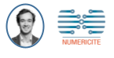

```{r, echo=FALSE}
library(metathis)
meta() %>% 
  meta_description(params$event) %>% 
  meta_name("github-repo" = paste0("datactivist/", params$slug)) %>% 
  meta_viewport() %>% 
  meta_social(
    title = params$title,
    url = paste0("https://datactivist.coop/", params$slug),
    image = params$image,
    image_alt = params$image_alt,
    og_type = "website",
    og_author = "Datactivist",
    og_locale = "fr_FR",
    og_site_name = "Datactivist",
    twitter_card_type = "summary",
    twitter_creator = "@datactivi_st")
```

layout: true

<style>
.remark-slide-number {
  position: inherit;
}

.remark-slide-number .progress-bar-container {
  position: absolute;
  bottom: 0;
  height: 4px;
  display: block;
  left: 0;
  right: 0;
}

.remark-slide-number .progress-bar {
  height: 100%;
  background-color: #e95459;
}


.pull-left-wide {
  width: 65%;
  float: left;
}

.pull-right-wide {
  width: 65%;
  float: right;
}

.pull-right-narrow {
  width: 30%;
  float: right;
}

.pull-left-narrow {
  width: 30%;
  float: left;
}

.quote {
  font-family: 'Rokkitt';
  font-weight: bold;
  font-style: italic;
  font-size: 28px;
}


.yellow-h{
   background: #ffff88;
}

.blue-h{
   background: #83c7fc;
}


</style>


`r paste0("<div class='my-footer'><span>", params$event, "</span> <center><div class=logo><a href='https://datactivist.coop/'></a></div></center></span></div>")` 


---

class: center, middle

Ces slides en ligne : `r paste0("http://datactivist.coop/", params$slug)`

Sources : `r paste0("https://github.com/datactivist/", params$slug)`


Les productions de Datactivist sont librement réutilisables selon les termes de la licence [Creative Commons 4.0 BY-SA](https://creativecommons.org/licenses/by-sa/4.0/legalcode.fr).

<BR>
<BR>


---

background-image: url("https://media.giphy.com/media/Y0mC3y5G53PsQ/giphy.gif")
class: center, top, inverse

# Présentation

---

## Qu'est-ce que le self data ?

--

> .quote["la production, l’exploitation et le partage de données personnelles par les individu·e·s, sous leur contrôle et à leurs propres fins"]

.right[
.caption[Source : [Kit Self Data Territorial](http://mesinfos.fing.org/implementer-le-self-data-sur-son-territoire-suivez-le-guide/), MesInfos / Fing]
]

--

<br><br>
Il s'agit de replacer des .yellow-h[opérations sur les données personnelles] (production, exploitation et partage) sous .blue-h[un régime de gouvernance centré sur les individus qu'elles concernent].

Le self data croise ainsi des considérations .yellow-h[techniques] et .blue-h[politiques.].


---


## Et le self data .red[territorial] ?

.center[

]

Initié par MesInfos, le projet Self data territorial organise depuis 2018 la mise en place de dispositifs d'expérimentation sur trois territoires pilotes :

* **la métropole du Grand Lyon** ;
* **Nantes Métropole** ;
* **la ville de La Rochelle** (depuis repris par la Communauté d'Agglomération).


---

## Qu'est-ce que c'est que ce programme ?

.center[

]

---

## A quoi cela va-t-il servir ?

.center[

]

--

1. sensibiliser aux questions de mobilité ;
2. tester des outils ;
3. tester un dispositif d'accompagnement au changement de comportement ;
4. collecter des données scientifiques sur l'expérimentation.

---

## Qui sommes-nous ?

.pull-left[
.center[#### Sylvain Lapoix (Datactivist)


*responsable recrutement et animation de la communauté de bêta-testeurs*

]

***

* consultant, analyste, et formateur chez **.red[[Datactivist](https://datactivist.coop/fr/)]** ;
* datajournaliste et coauteur pour le programme [#DATAGUEULE](https://www.youtube.com/user/datagueule) de France télévisions ;
* basé à La Rochelle (La Pallice) ;
* je suis cycliste, végétarien et amateur de funk.


]

.pull-right[
.center[#### Romain Le Gall (Numéricité)



*chef de projet - responsable coordination des chantiers*
]

***

* consultant pour **.red[[Numéricité]()]**
* basé à Lyon ;
* grimpeur du week-end.

]


---

## Quel est votre rôle ?

.center[

]

--

En résumé :
* utiliser les outils ;
* répondre à des questionnaires ;
* participer aux activités si vous le souhaitez.

---

## A quoi sert ce rendez-vous ?

--

.center[

### A vous rendre l'expérience la plus confortable et profitable possible !
]

---

background-image: url("https://media.giphy.com/media/3otPoOi7E60TCnAdmE/giphy.gif")
class: center, top, inverse

# Organisation générale

---

## Actions !


* ### des outils ;
* ### des formations ;
* ### des enquêtes.

---

## Réactions !


* ### du suivi ;
* ### des corrections ;
* ### des développements.


---


background-image: url("https://media.giphy.com/media/DUtVdGeIU8lmo/giphy.gif")
class: center, top, inverse


### Et nous restons à votre dispo pour toute question !

---


background-image: url("https://media.giphy.com/media/jOyc4EahGNPb3FoNuk/giphy.gif")
class: center, top, inverse

## Les points de contact


---

### Les permanences

.red[Deux fois par mois] sur **Gather town**.

.center[

]

Pour échanger, se former, découvrir les partenaires, faire communauté ...

---


### ... en attendant des permanences in situ ?

--

.center[


#### (avec respect des règles sanitaires)
]

---

### La newsletter

.red[Deux fois par mois] dans **la boîte mail dont vous nous avez donné l'adresse** (ou dans vos spams, parfois !)

.pull-left-wide[

]

.pull-right-narrow[Pour partager avec vous les actualités du projet, notre veille sur les sujets du programme (mobilités, données personnelles, changement de comportement ...), les événements organisés par nos partenaires (et vous relancer pour répondre questionnaires).]

---

class: center, top

### Notre "numéro vert" !


#### La boîte mail de [l'équipe du self data territorial de la Communauté d'Agglomération de La Rochelle](mailto:sylvain@datactivist.coop)* est là pour vous !

--

.footnote[\* Vous pouvez nous appeler<br>.red[Sylvain] et .red[Romain.]]

---

## Les outils

.center[

]

---

### Centraliser vos données avec Cozy

--

.center[Mais nous allons détailler ça après.
]

---


background-image: url("https://media.giphy.com/media/3oEjHRqYidxvH7GaVa/giphy.gif")
class: center, top, inverse

## Vos droits


---

### Traitement (1/2)

Le responsable de traitement des données des utilisateurs est la Fabrique des Mobilités. Les conditions générales d’utilisation (CGU) présentes à ce lien sont les CGU complètes de l’application mobile TraceMob.

Les données traitées sont les suivantes : 

.pull-left[
#### Finalité 1 : identification de l’utilisateur pour retrouver ses données dans la base de données :
* Token utilisateur unique ;
* Horodatage de création de l’utilisateur ;
* Système d’exploitation associé ;
* Identifiant unique de l’appareil.
]

.pull-right[
#### Finalité 2 : visualisation des traces de mobilités par l’utilisateur ou le bêta-testeur avec une estimation de son empreinte carbone.
* Positions géographiques détectées par le système d’exploitation du téléphone.]


---

### Traitement (2/2)

#### Finalité 3 : nettoyage et correction des traces de mobilités pour que l’utilisateur puisse les visualiser.
* Positions géographiques détectées par le système d’exploitation du téléphone
* Vitesses détectées par le système d’exploitation du téléphone 
* Modes de transports détectés par le système d’exploitation du téléphone
* Les données susmentionnées sont obligatoirement collectées pour pouvoir bénéficier des services proposées par l’application, à savoir la visualisation de ses traces de mobilités et l’estimation de l’empreinte carbone liée à ses déplacements. Aucun traitement de donnée ne donne lieu à une prise de décision individuelle automatisée, ni à un profilage.


Si l’utilisateur ne souhaite pas que ces données soient communiquées au serveur, il est alors dans l’impossibilité d’utiliser l’application TraceMob.

---

### Stockage

Les données brutes sont stockées sur le smartphone de l’utilisateur et envoyées au fil de l’eau à un serveur effectuant chaque nuit un traitement pour améliorer les données. Le traitement consiste en 8 étapes qui sont détaillées dans les CGU complètes (paragraphe 6.b.). Conformément à la réglementation en vigueur, les données sont traitées dans un serveur hébergé en France par la société OVH. 

---

### Droits sur les données :
* **Droit d’information** : l’Utilisateur peut demander à tout moment à TraceMob quelles sont les données traitées à son sujet.
* **Droit de rectification** : l’Utilisateur peut rectifier les données à son sujet si elles s’avèrent inexactes.
* **Droit d’accès** : l’Utilisateur peut demander à TraceMob de lui envoyer l’ensemble des données traitées à son sujet. 
* **Droit d’opposition** : l’Utilisateur peut s’opposer au traitement sous certaines conditions.
* **Droit à la suppression** : l’Utilisateur peut demander la suppression de ses données à caractère personnels
* **Droit de limitation** : l’Utilisateur peut demander au responsable de traitement de geler temporairement l’utilisation de certaines de ses données 
* **Droit à la portabilité** : l’Utilisateur peut demander une copie de ses données à caractère personnel. 

La possibilité de quitter l’expérimentation en envoyant un e-mail à l'adresse suivante : larochelle@selfdata.org

Le contact de l’expérimentation Self Data Territorial : larochelle@selfdata.org 

---


---
class: inverse, center, middle

# Merci ! Des questions ?

Contact : [Sylvain](mailto:sylvain@datactivist.coop) et [Romain](r.legall@numericite.eu)