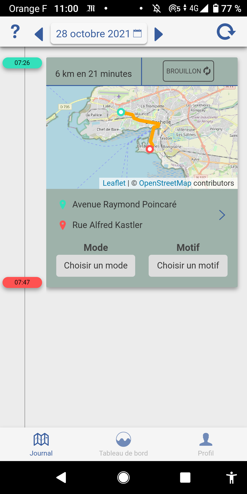

layout: true
  

`r paste0("
", params$event, " 

")` 

---

## Le self data

Les modèles de gouvernance des données personnelles :

.pull-left[**modèle dominant**

*"app to data"* : la propriété et la gestion des données sont déléguées aux fournisseurs de services qui captent les donneés.
]

.pull-right[**modèle alternatif**

*"data to app"* : les données sont détenues et gérées par ceux et celles qu'elles concernent, individuellemnt ou collectivement.
]

Le **.red[self data]** est un concept  théorisé par la Fondation interne nouvelle génération, qu'elle résume d'une phrase :

> "la production, l’exploitation et le partage de données personnelles par les individu·e·s, sous leur contrôle et à leurs propres fins \*"

.footnote[\* [Kit Self Data Territorial](http://mesinfos.fing.org/implementer-le-self-data-sur-son-territoire-suivez-le-guide/), MesInfos / Fing]

---

## Le self data territorial

Parmi les modèles de gouvernance proposés, le .red[**self data territorial**] repose sur le principe du tiers de confiance comme garant de l'intégrité des données et de leurs usages.

Les EPCI disposent de la compétence politique sur les sujets d'intérêt général visés par le self data et couvrant un périmètre humain et spatiale cohérent. La Fing a jugé qu'elles étaient un tiers de confiance pertinent pour expérimenter le self data de manière efficace.

La Fing expérimente le self data territorial avec trois agglomérations partenaires en France :

---

## La démarche de La Rochelle : mobilité, données, privacy

Le self data territorial de .lr_bg[la Communuauté d'Agglomération de La Rochelle] s'inscrit dans la continuité de deux grands projets territoriaux :

* La Rochelle Territoire Zéro Carbone ;
* Agremob.

.pull-left[
.center[
**Objectif**

*expérimenter avec un groupe de 500 bêtatesteurs et bêtatesteuses des outils de réappropriation des données et collecter des données scientifiques afin d'étudier les changements de comportement permis par l'information sur l'impact carbone des mobilités.*]
]

.pull-left[
.center[
**Partenaires**

* .red[**recruteurs**] : CdA La Rochelle, ville de La Rochelle, Université de La Rochelle, Excelia, Eigsi, J'adopte un projet ;
* .red[**scientifiques**] : Cnam, Excelia, Université de La Rochelle ;
* .red[**techniques**] : La Fabrique des mobilités, Cozy.
]
]

---

.center[
### TraceMob *un capteur "self data by design"*
]
.pull-left-wide[
L'application .red[**TraceMob**] est le premier outil du self data territorial : **un capteur personnel de traces de mobilité conçu pour le self data**.

Adapté par La fabrique des mobilités à partir de l'application [e-Mission](https://e-mission.eecs.berkeley.edu/#/home) développée par l'Université de Berkeley, l'app capte **les points GPS** en arrière-plan dès qu'un mouvement est repéré.

Ces points sont ensuite transmis pour traitement par des modèles pour reconstituer des **trajets**, desquels sont prédits des **modes** de déplacement et calculé une **empreinte CO2**.

Les données ne sont **ni stockés, ni consultables** et les flux ne sont **pas réidentifiables** à leur propriétaire.

]

.pull-right-narrow[

]

---
.center[
### Cozy - *le cloud personnel*
]

.pull-left-wide[
La société **Cozy cloud** met à disposition des participant·es un .red[**cloud personnel optimisé pour le self data territorial**].

]

.pull-right-narrow[
La société Cozy Cloud a développé à destination des bêtatesteurs et bêtatesteuses un **connecteur** dédié à TraceMob. Cette extension permet de récupérer les documents produits par l'app en format brut.

Le Cozy assure ici une fonction d'**archivage sécurisé et personnel** permettant de connecter les apps suivant le choix de son propriétaire.
]

---

.center[
### CoachCO2 *l'outil d'aide au changement*
]

La société **Cozy cloud** développe actuellement une extension du cloud personnel prenant la forme d'un .red[**outil d'aide au changement de comportement basé sur les données de mobilité**].

En cours de développement, .red[**CoachCO2**] offrira plusieurs fonctionnalités sur la base des traces récoltées par les bêtatesteurs et bêtatesteuses ;

* exploration des traces via une interface de recherche avancée (avec filtres temporels, géographiques, par mode, etc.) ;
* annotation / correction ;
* historicisation des distances, émissions avec possibilité de regroupement ;
* comparaison à un groupe cible, à N -1 an, etc.

Ces fonctionnalités sont sélectionnées et évaluées avec l'aide d'un panel de participant·es volontaires.

---

.center[
### Volet scientifque
]

.pull-left-wide[
Les bêtatesteurs et bêtatesteuses s'engagent également à participer à une .red[**collecte de données socio-métrologiques**] visant à mieux comprendre les mécanismes de changement de comportement.

Une équipe du Cnam assure la collecte de ces données auprès des participant·es via deux canaux :
* questionnaires scientifiques ;
* entretiens semi-directif.

Ces données seront traitées et analysées dans le cadre de publications scientifiques. Elles font également l'objet de restitution auprès des participant·es et partenaires de l'expérimentation.
]

.pull-right-narrow[**Objectifs**

* étudier la capacité des outils numérique à changer des comportements ;

**Champs d'étude**

* sociologie ;
* socio-métrologie ;
* sciences de l'information.
]

---

## Alstom, partenaire naturel

.pull-left-narrow[
Plusieurs faits nous apparaissent désigner .red[**Alstom**] comme un partenaire naturel pour l'expérimentation self data territorial :

.center[

]
]

.pull-right-wide[

* **membre fondateur de La Rochelle Territoire Zéro carbone**, l'entreprise affiche une démarche volontaire quant aux sujets de réduction de ses émissions et de participation aux politiques publiques de transition écologique ;

* **employeur emblématique du territoire de La Rochelle** le site d'Aytré s'inscrit dans le paysage économique, social et politique de l'Aunis comme un potentiel *"leader d'opinion"* des bonnes pratiques RSE au niveau local ;

* **entreprise clef de la transition énergétique**, Alstom apparaît comme un candidat évident à un projet de politique publique innovante dans le domaine.
]

---

## Un panel d'actions variées

Le programme self data territorial a développé depuis début 2021 une large palette d'action visant à recruter, fidéliser et sensibiliser autour des outils qu'il propose.

Nous distinguons deux types d'actions :
* les **actions de contact** qui visent à faire connaître le projet et se mettre à l'écoute des problématiques auxquelles la démarche peut répondre ;
* les **actions d'engagement** qui offrent la possibilité d'user des outils du self data pour accomplir un changement collectif ou individuel dans le sens de la transition énergétique.

Par expérience, nous recommandons d'initier toute démarche par une .red[**action de contact**] permettant d'identifier le programme avant de proposer une .red[**action d'engagement**] apparaissant comme un cadre d'activation de son offre.

Pour Alstom, nous proposons le parcours suivant :

---

### 1. Permanence self data (contact)

.pull-left[

Sur la pause du déjeuner (11h30 à 13h30), un membre de l'équipe self data s'installe à un point de rencontre sur le site d'Aytré. Avec café, flyer et ordinateur, il propose une présentation exhaustive du projet, renseigne les intéressé·es, répond aux questions.
]

.pull-right[**Bénéfices pour Alstom**

* la démarche compte comme sensibilisation dans le cadre du projet Agremob ;
* l'animation peut s'inscrire dans les projets RSE internes..

**Bénéfices pour les salarié·es**

* les salarié·es ont accès à toute la documentation nécessaire ;
* les volontaires sont accompagné·es dans les démarches d'initiation ;
* c'est l'occasion de mettre un visage (ainsi qu'un mail et un numéro de téléphone) sur le projet.

]

---

### 2. Autodiagnostic PDM (engagement)

.pull-left[
L'équipe projet du plan de mobilité (PDM) est accompagnée dans l'installation, le paramétrage et l'extraction des données de mobilité du capteur TraceMob.

.red[**Un bilan ex ante**] est réalisé par le groupe projet pour obtenir des données d'impact carbone des mobilités "au naturel". Ces données sont analysées collectivement suivant une méthodologie proposée par l'équipe du self data.

Sur cette base, des propositions d'adaptation sont formulées pour réduire l'impact carbone. Un .red[**bilan ex post**] peut être mis en place pour mesurer l'effet des tests.
]

.pull-right[**Bénéfices pour Alstom**

* les ateliers jouent le rôle d'émulateur d'équipe ;
* l'outil de mesure offre des données historicisables permettant la mesure d'impact des solutions.

**Bénéfices pour les salarié·es**

* le capteur TraceMob permet d'objectiver l'impact CO2 des mobilités individuelles ;
* la production de données constitue un objet de débat appropriable et concret.

]

---

### 3. "Challenge covoit" (engagement)

.pull-left[
L'équipe du self data donne un mois aux salarié·es d'Alstom pour adopter le plus possible ce mode de transport ! A l'aide de l'application TraceMob, les salarié·es sont invités à mettre en communs leurs traces avec leurs collègues et récupérer les preuves de trajet BlaBlaCar ou Klaxit pour .red[**calculer les kilomètres "partagés"**] au cours du mois.

Les récompenses ? Des invitations dans un spa d'exception à Chatelaillon, des heures d'escalade aux Minimes, des bons pour des croisières ... et un diplôme certifiant de la quantité de carbone "partagé" à l'occasion de l'expérience !
]

.pull-right[**Bénéfices pour Alstom**

* le concours donne l'occasion de promouvoir l'usage du covoiturage en entreprise ;
* le projet peut s'inscrire dans diverses démarches RSE ou aménagements.

**Bénéfices pour les salarié·es**

* les salarié·es trouvent un intérêt objectif à expérimenter le covoiturage et identifier de possible économies de budget transport ;
* le challenge offre l'occasion de réfléchir collectivement à l'optimisation des trajets.

]

---

class: inverse, center, middle

# Vos référents

Contact : [Sylvain Lapoix](mailto:sylvain@datactivist.coop).