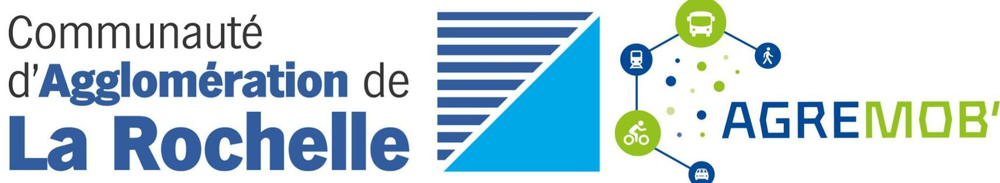

# *Le chemin caché de vos données de mobilité*

## Une série de webinaires proposés par la Commuunauté d'Agglomération de La Rochelle et le programme Agremob

## Formateur
* Sylvain Lapoix [Datactivist](https://datactivist.coop/))
  
## Programme

  | Jour | Module | Thématique | 
  | :-----: | :-----: |  -----: | 
  | 28/07/2022 | Partie 1 | **Un mouchard de poche** | 
  | 04/08/2022 | Partie 2 | **Le GPS-business** | 
  | 25/08/2022 | Partie 3 | **Vers la liberté de mouvement** | 

## Supports

1. [Le chemin caché de vos données de mobilité : 1/3 Un mouchard de poche](https://datactivist.coop/agremob_selfdata/webinaire_mobilites_selfdata/webinaire_mobilites_ep_1/#1)
2. [Le chemin caché de vos données de mobilité : 2/3 Le GPS-business](https://datactivist.coop/agremob_selfdata/webinaire_mobilites_selfdata/webinaire_mobilites_ep_2/#1)
3. [Le chemin caché de vos données de mobilité : 3/3 Vers la liberté de mouvement](https://datactivist.coop/agremob_selfdata/webinaire_mobilites_selfdata/webinaire_mobilites_ep_3/#1).

## Documentation et ressources

- à venir -