layout: true
  

`r paste0("
", params$event, " 

")` 

---

background-image: url("https://media.giphy.com/media/zBcAGK8LqMXSCAZS1A/giphy.gif")
background-size: contains
class: inverse

# Introduction - "Rien à cacher ..."

---

## Juste l'endroit d'où on appelle ...
.pull-left-wide[
En 2008, l'Allemagne implémente la directive sur la conservation des données.

Elle obligeait les opérateurs téléphoniques à conserver pendant six mois de nombreuses données détaillées sur les activités des usager·ères : numéro d'appel entrant et sortant, durée des appels, adresses IP ... .red[**et localisation des téléphones**].

Désireux de montrer le risque pour le simple citoyen, **le député fédéral écologiste Malte Spitz** (ci-contre) demande à son opérateur Deutsch Telekom, six mois des données visées par la nouvelle loi.
]

.pull-right-narrow[

]

---

background-image: url("https://media.giphy.com/media/yTVqsXTWQRewFBJgCD/giphy.gif")
class: inversen, center

## Mais on ne peut rien apprendre d'important de ces données ... pas vrai ?

---

### Alors en fait ...

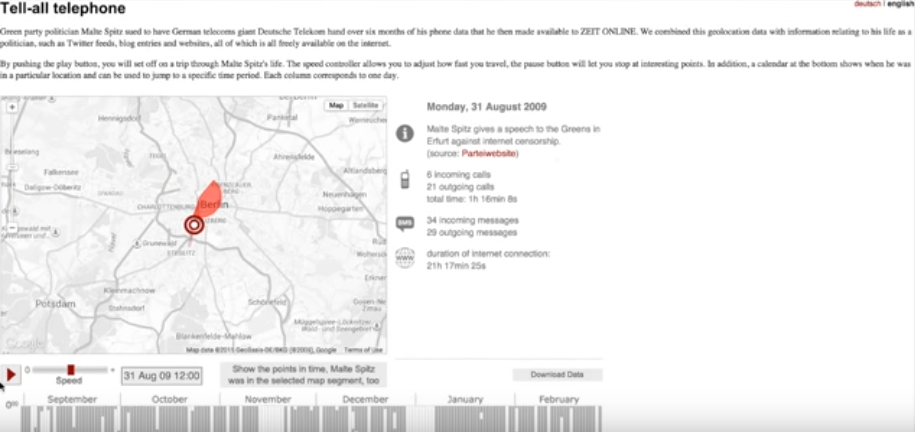

.footnote[
Source : Die Zeit, 2010, [sur YouTube](https://www.youtube.com/watch?v=25Smp8_g9u0), [l'article original](https://www.zeit.de/datenschutz/malte-spitz-data-retention) n'est plus disponible.
]

---

### Et je voudrais pas vous inquiéter mais ...

--

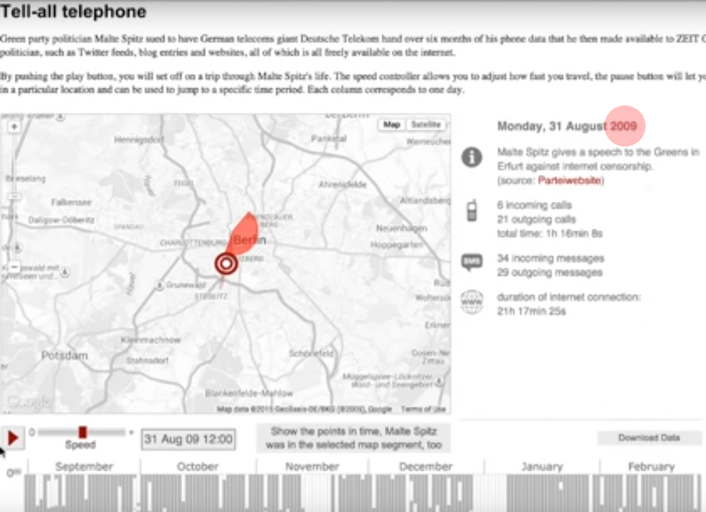
]

---

### Quelques questions auxquelles ce webinaire propose de répondre

1. comment mon téléphone sait où je suis ?
2. comment (et par qui ?) sont captées ces données ?
3. comment sont-elles analysées ?
4. à quoi (et qui ???) d'autre servent-elles ?
5. comment mieux les maîtriser ?

---

background-image: url("https://media.giphy.com/media/W7KGFCXzNfQTNYEgL7/giphy.gif")
class: inverse

# 1. Téléphone et voiture, des outils de géoloc massive

---

### Le "besoin" de géolocalisation des téléphones

.center[
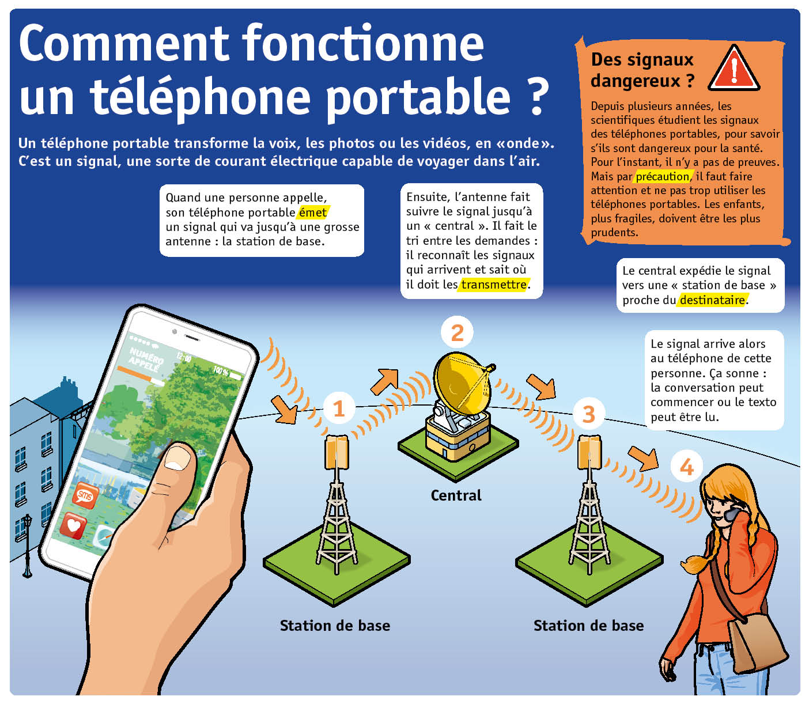
]

.footnote[Source : [Le Petit Quotidien](https://lepetitquotidien.playbacpresse.fr/exposes-detail/lepq/comment-fonctionne-un-telephone-portable-1)]

---

### Méthode 1 : Le bornage

.center[
.reduite[
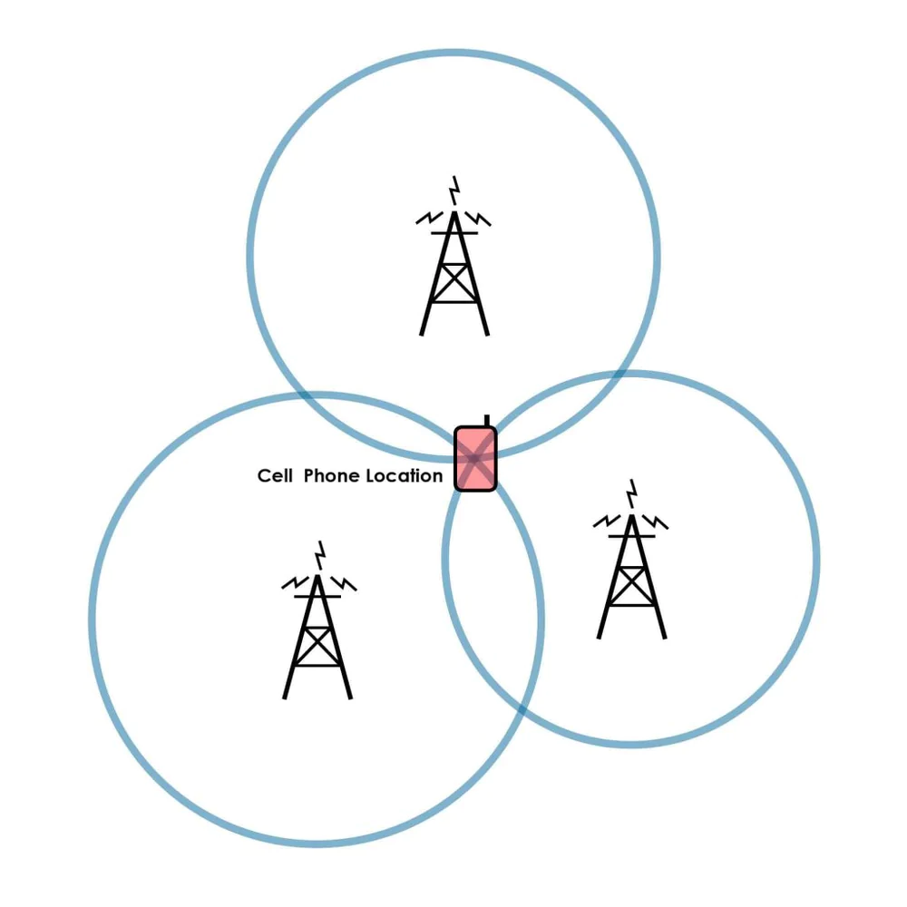
]
]

.footnote[
Source illustration : [Irislab](https://www.irislab.com/fr/blogs/matthews-blog/triangulation).
]

---

### Méthode 2 : le GPS

.pull-left[
**1. Un réseau**

* émetteur : 30 satellites à 20000 km d'altitude ;
* récepteur : des capteurs GPS.

**2. Un signal**
Des "pulse" contenant 3 données :

* nom du satellite ;
* heure de départ ;
* position.
]

.pull-right[
**3. Un calcul**

distance = (heure d'arrivé - heure de départ) * C

C : vitesse de la lumière

**4. Une triangulation**

La distance de trois pulse suffit à situer n'importe quel point en 3D.

**5. Trois coordonnées**
X ; Y ; Z.
]

---

### Spoiler : votre voiture aussi

.center[
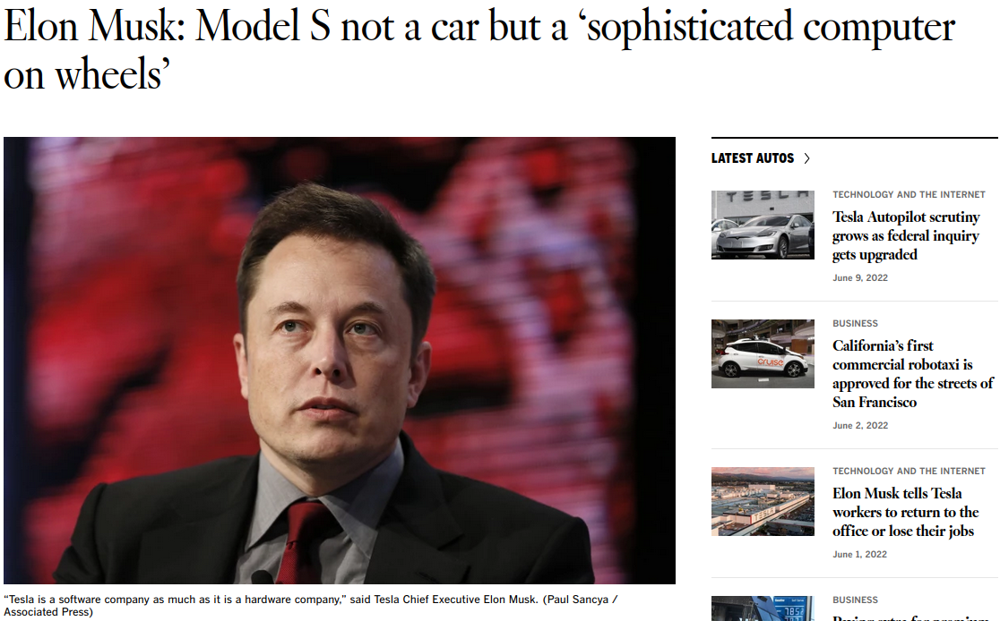
]

.footnote[Source : [Los Angeles Times, 19 mars 2015](https://www.latimes.com/business/autos/la-fi-hy-musk-computer-on-wheels-20150319-story.html)]

---

### Ce que votre Tesla raconte à Elon Musk

.center[
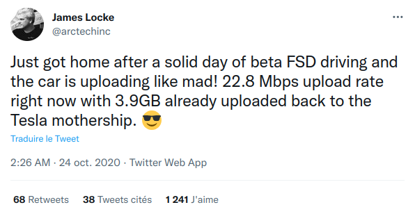
]

Source : [Twitter](https://twitter.com/arctechinc/status/1319797485712203776).

---

### Et même si vous n'avez pas de Tesla ...

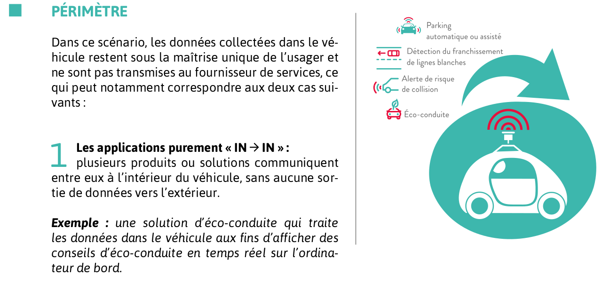

Extrait du rapport de la Cnil sur le "[pack de conformité véhicules connectés](https://www.cnil.fr/fr/vehicules-connectes-un-pack-de-conformite-pour-une-utilisation-responsable-des-donnees)".

---

background-image: url("https://media.giphy.com/media/cGEASD6uhbOPyF5FQ5/giphy.gif")
class: inverse

# 2. Un mouchard de poche

---

background-image: url("https://media.giphy.com/media/j27AFdZgwiiBrO8tvK/giphy.gif")
class: inverse

## Données localisation d'appel

---

### "Mouchard de poche"

.footnote[Source : [Le Monde](https://www.lemonde.fr/a-la-une/article/2011/07/15/la-puce-de-telephone-mouchard-de-poche_1549070_3208.html).]

---

### Cas d'usage : les données Covid

.center[
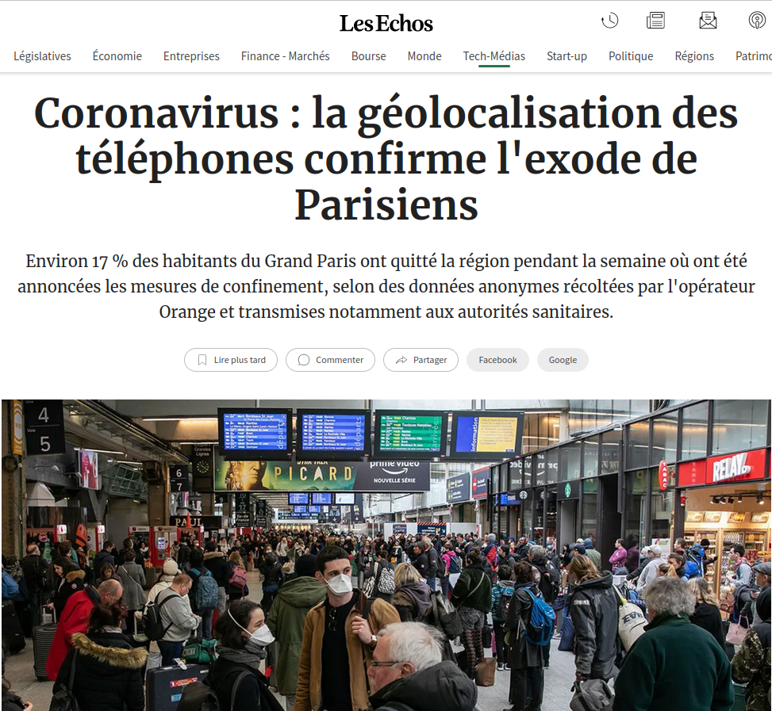
]

Source : [Les Echos](https://www.lesechos.fr/tech-medias/hightech/coronavirus-la-geolocalisation-des-telephones-confirme-lexode-de-parisiens-1189565).

---

### L'outil Flux Vision d'Orange

.center[
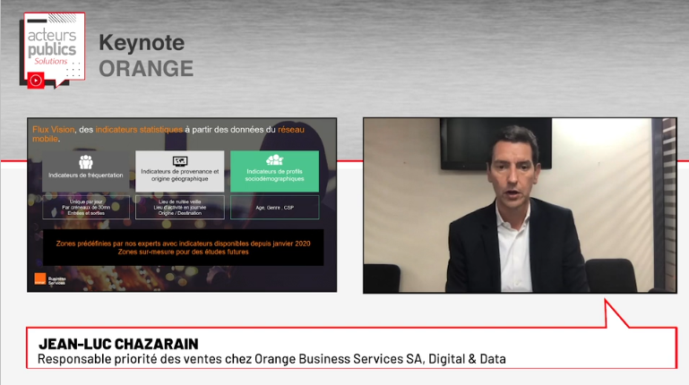
]

.footnote[Source : [Acteurs publics](https://acteurspublics.fr/webtv/emissions/acteurs-publics-solutions/flux-vision-la-modelisation-des-deplacements-de-population-pendant-la-crise).]

---

### Cas d'usage : géolocalisation via SMS

.center[
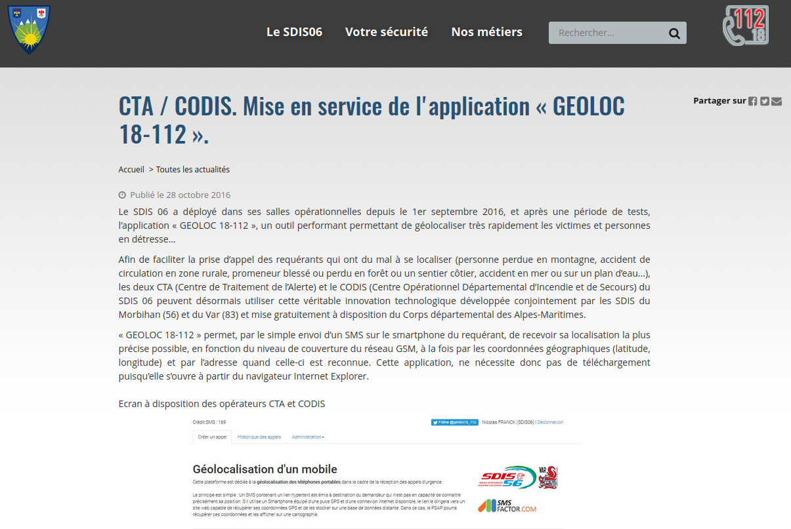
]

Source : [SDIS06](https://www.sdis06.fr/jcms/psdis_15393/cta-/-codis-mise-en-service-de-l-application-geoloc-18-112).

---

background-image: url("https://media.giphy.com/media/6bh9FTTEKdtZe/giphy.gif")
class: inverse

## Données GPS

---

### Petit concours : qui se fait le plus tracker ?

.pull-left[**Android**
.reduite[
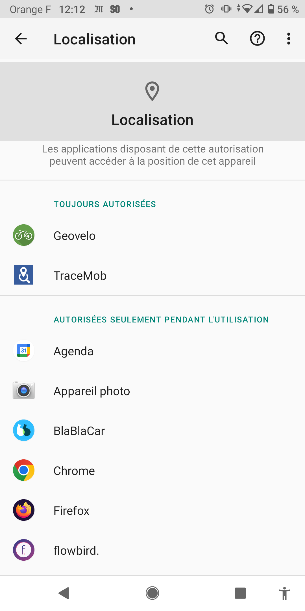
]
]

.pull-right[**iOS**
.reduite[
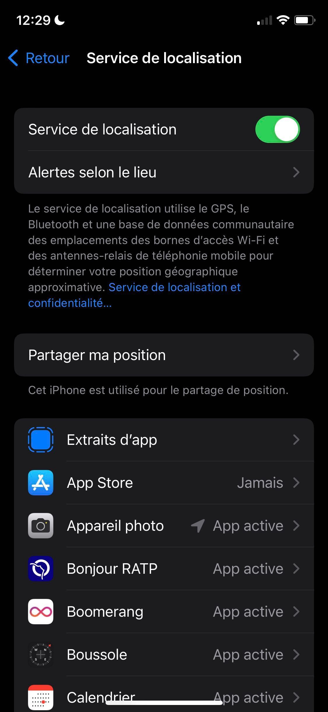
]
]

---

### Régimes de partage

.pull-left[**Android**

]

.pull-right[Quatre cas sont évoqués :

* en permanence (arrière-plan) ;
* en usage ;
* à la demande ;
* jamais.

Mais le détail de à qui et pour quoi sont transférées les données n'est pas fourni.
]

---

background-image: url("https://media.giphy.com/media/9ryK98PxAGLxifr9aD/giphy.gif")
background-size: contains
class: inverse

### De quelle droit ces données sont-elles collectées ?

---

background-image: url("./img/waze_cgu.png")
background-size: contain

### .white-h[Parce que vous avez donné votre accord aux CGU*]

.footnote[
.white-h[\*Conditions générales d'utilisation.]
]

---

background-image: url("https://www.visualcapitalist.com/wp-content/uploads/2020/04/length-of-service-agreements-1.jpg")
background-size: cover

### .white-h[Et, vous les avez lues avant ?*]

.footnote[
Source image : [Visual Capitalist](https://www.visualcapitalist.com/terms-of-service-visualizing-the-length-of-internet-agreements/)]
]

---

background-image: url("https://media.giphy.com/media/yMwWgfNqIO8Kc/giphy.gif")
background-size: cover
class: inverse, center

## Bienvenue dans le monde merveilleux de la gouvernance des données

---

### Le RGPD : un début de cadre

.center[
.reduite[

]
]

Adopté par le Parlement européen en 2016 et porté en droit français en 2018, le Règlement général sur la protection des données (ou RGPD) encadre la collecte, le traitement, l'utilisation et la conservation des données dans l'Union européenne.

Source illustration : [Cnil](https://www.cnil.fr/fr/rgpd-de-quoi-parle-t-on).

---

background-image: url("https://media.giphy.com/media/qPkOReBnmmETgX5RMs/giphy.gif")
background-size: cover

### Le droit à la portabilité, progrès concret

---

background-image: url("https://media.giphy.com/media/VXCPgZwEP7f1e/giphy-downsized-large.gif")
background-size: contains
class: inverse, center

### .black-h[Et, vous allez l'utiliser ?]

--

### .black-h[Comme beaucoup de gens : non.]

--

.footnote[
.black-h[... et on peut pas vous en vouloir.]
]

---

background-image: url("https://media.giphy.com/media/j1RdWetLBJQIdP8TnK/giphy.gif")
class: inverse

# 3. A quoi servent vos données ?

---

background-image: url("https://media.giphy.com/media/j1RdWetLBJQIdP8TnK/giphy.gif")
background-size: contains
class: inverse, center

### Qui parmi vous utilise Waze ?

---

background-image: url("https://media.giphy.com/media/EaMTsoYxfPpuw/giphy.gif")
background-size: contains
class: inverse, center

### Qui parmi vous utilise Strava ?

---

background-image: url("https://media.giphy.com/media/i44JJHlvLsbIjY7uJ4/giphy.gif")
background-size: contains
class: inverse, center

### Qui parmi vous utilise Géovélo ?

---

background-image: url("https://media.giphy.com/media/1wANL9kM16LyszJjms/giphy.gif")
background-size: contains
class: inverse, center

### En fait, elles marchent presque pareil ...

---

#### Capter les données GPS 1/2

Dès qu'un mouvement est capté par .red[l'accéléromètre], l'app débute la collecte des données issues du .red[GPS] (elle se branche aussi sur d'autres capteurs pour être plus précise : WiFi, Bluetooth, 4G ou 5G).

.center[

---

#### Capter les données GPS 2/2

Quand .red[l'accéléromètre] note un arrêt prolongé du mouvement, l'app cesse la collecte de données du capteur .red[GPS].

.center[

]

---

background-image: url("https://media.giphy.com/media/bcrOR2stk6tKIxqPOZ/giphy.gif")
background-size: contains
class: inverse, center

### Mais alors, quelles sont les différences ?

---

### La façon dont les données sont analysées

Quels sont les *"priorités"* des apps ?

.pull-left[
* .red[Waze] cherche **l'efficacité** ;
* .red[Strava] cherche **la performance** ;
* .red[Géovélo] cherche **l'efficacité** et **la sécurité**.
]

--

.pull-right[
> Et quelles dimensions ne sont pas envisagées ?

]

--

Par exemple : le coût ou la dangerosité du trajet, la beauté des paysages, la fatigue du sportif ...

---

### Prenons l'exemple de Waze

.pull-left[L'appli Waze fonctionne selon un principe de *crowdsourcing* :

1. de la géolocalisation des véhicules ;
2. des signalements des automobilistes ;
3. des informations sur les comptes individuels.

]

.pull-right[Les données personnelles sont donc collectées et traitées pour élaborer des itinéraires.

Waze vous propose **sa** version de l'itinéraire, selon ses critères (principalement durée du trajet et péages) et se réserve le droit de réutiliser vos données selon ses propres termes (collecte, traitement, stockage et partage.]

---

background-image: url("https://media.giphy.com/media/NRXkUDFD50xUIHsYwY/giphy.gif")
class: inverse

# 4. Sortie de route : le repartage

---

## D'autres versions de vos apps existent ...

---

### Des "données situées"

.pull-left[
La chercheuse Jill Walker Rettberg a étudié l'application Strava pour introduire le concept de *données situées*. 

]

.pull-right[
En pratique, Strava collecte principalement les données GPS des usager·ères.

Elle identifie quatre façons dont l'entreprise Strava les distribue :
1. on voit ses propres données dans l'app ;
2. on voit les données globales en datavisualisations ;
3. les urbanistes peuvent acheter un accès à des dashboards avec Strava Metro ;
4. la donnée peut être traitée par une application de navigation pour calculer le meilleur chemin.
])

---

### Strava Metro

.center[

]

.footnote[Source : [Strava Metro](https://medium.com/strava-metro/evaluating-and-utilizing-strava-metro-cycling-data-in-the-netherlands-34f834b346c9)]

---

### La vente de données

.pull-left[
Le marché du "courtage de données en localisation" a été estimé à 12Mrds$.

Source : [The Markup](https://themarkup.org/privacy/2021/09/30/theres-a-multibillion-dollar-market-for-your-phones-location-data).
]

.pull-right[

]

---

### En France aussi !

.center[

]

Source : [Numérama](https://www.numerama.com/politique/282934-enquete-comment-les-apps-figaro-lequipe-ou-closer-participent-au-pistage-de-10-millions-de-francais.html).
---

background-image: url("https://media.giphy.com/media/qM1no2HQy8GAargsAs/giphy.gif")
class: inverse

# 5. Bonnes pratiques

---

## D'abord, faire un état des lieux

.pull-left[**Listez les apps**

]

.pull-right[**Regardez ce que Google sait de vous**

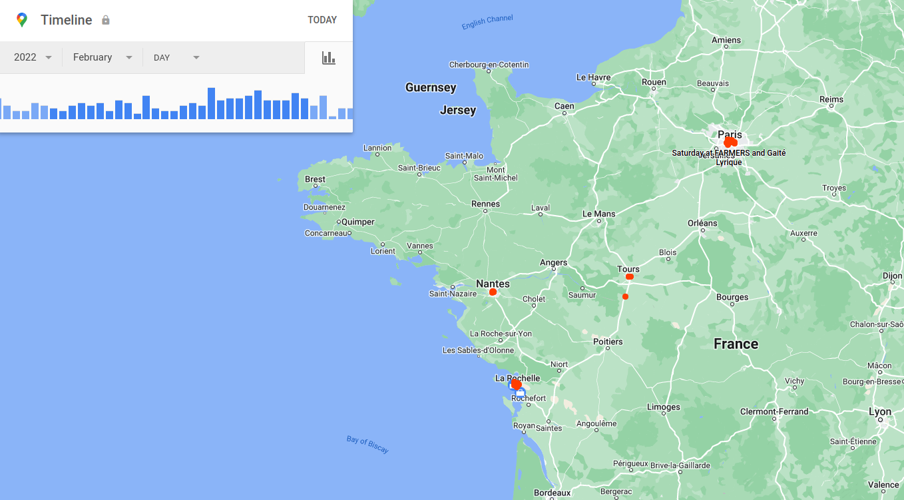
En allant sur [timeline.google.com](https://timeline.google.com/maps/timeline).
]

---

## Configurer son téléphone

---

## Configurer ses comptes

---

## Utiliser des apps respectueuses

---

## Rester vigilant·e

---

background-image: url("https://media.giphy.com/media/wHvK3FUDRQuL1UsNGM/giphy.gif")
class: inverse

## ... s'interroger sur d'autres façons de faire ?

---

background-image: url("https://media.giphy.com/media/ABZf61lhthe5GVreim/giphy.gif")
class: inverse

# 6. D'autres modèles de partage de gouvernance de la donnée ?

---

## Le self data !

> .quote["la production, l’exploitation et le partage de données personnelles par les individus, sous leur contrôle et à leurs propres fins"]

Deux dimensions se croisent dans cette définition :

.pull-left[#### *Les opérations*

* la production ;
* l'exploitation ;
* le partage]

.pull-right[#### *Leurs modalités*

* sous le contrôle des individus ;
* à leur propre fin.]

Leur objet central, **les données personnelles**, justifie les modalités évoquées : il s'agit de réinvestir les usager·ères dans les data produites à leur sujet.

.right[
.caption[Source : [Kit Self Data Territorial](http://mesinfos.fing.org/implementer-le-self-data-sur-son-territoire-suivez-le-guide/), MesInfos / Fing]
]

---

### OK mais pour quoi faire ?

---

## Impact CO2 des déplacements

.center[

]

.footnote[Source : [MyCO2, Carbone4](https://www.carbone4.com/myco2-empreinte-moyenne-evolution-methodo)]

---

## Des modèles pour calculer l'impact

.center[
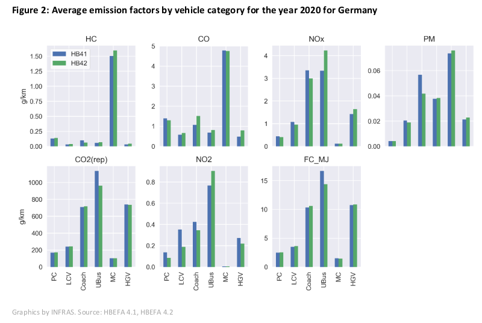
]

.footnote[Extrait de la documentation du [référentiel HBEFA](https://www.hbefa.net/e/index.html), utilisé par l'application TraceMob, [voir code source](https://github.com/e-mission/e-mission-phone/blob/f12c54b17babb0da8f1bbdc380450ec9664124d0/www/js/metrics-mappings.js#L59).]

---

background-image: url("https://media.giphy.com/media/4JVTF9zR9BicshFAb7/giphy.gif")
background-size: contains
class: inverse

### Avec le mode et le trajet, on peut donc calculer les émissions de CO2

---

.center[
### TraceMob *un capteur "self data by design"*
]
.pull-left-wide[
L'application .red[**TraceMob**] est le premier outil du self data territorial : **un capteur personnel de traces de mobilité conçu pour le self data**.

Adapté par La fabrique des mobilités à partir de l'application [e-mission](https://e-mission.eecs.berkeley.edu/#/home) développée par l'Université de Berkeley, l'app capte **les points GPS** en arrière-plan dès qu'un mouvement est repéré.

Ces points sont ensuite transmis pour traitement par des modèles pour reconstituer des **trajets**, desquels sont prédits des **modes** de déplacement et calculée une **empreinte CO2**.

Les données ne sont **ni stockées, ni consultables** et les flux ne sont **pas réidentifiables** à leur propriétaire.

]

.pull-right-narrow[
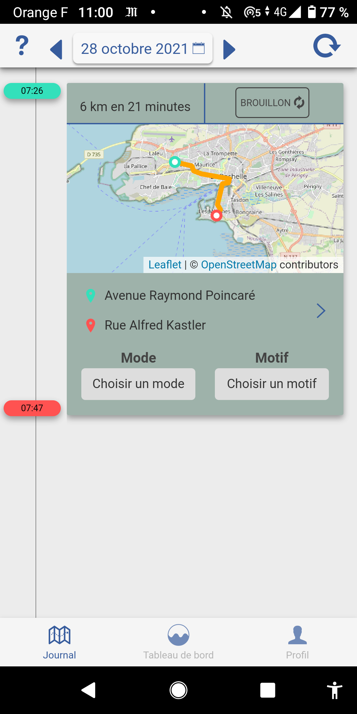
]

---

### e-mission

.pull-left[
TraceMob s'inspire d'une application développée par l'Université de Berkeley : [e-mission](https://e-mission.eecs.berkeley.edu).

Intégralement open source (son code est dispo sur Github), cette application vise à constituer un *"journal de trajet personnel"* en permettant la récolte des trajets et des données associées :

* horaires ;
* durée ;
* trajectoires ;
* mode de transport.
]

.pull-right[
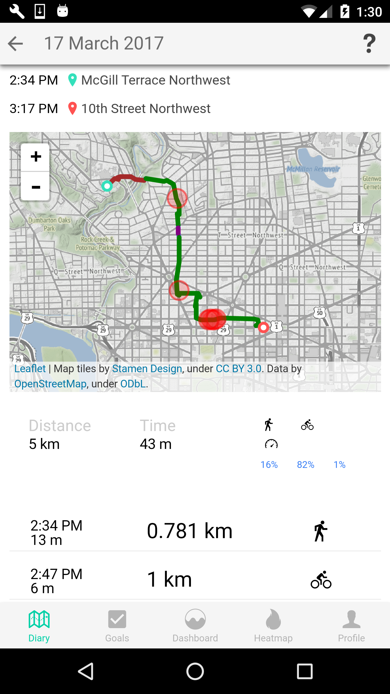
]

---

### TraceMob, une évolution d'e-mission

.center[
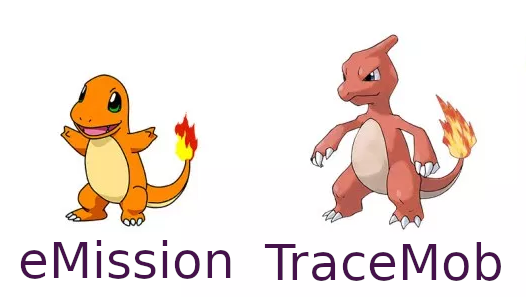
]

---

### Les différents "self data"

.center[
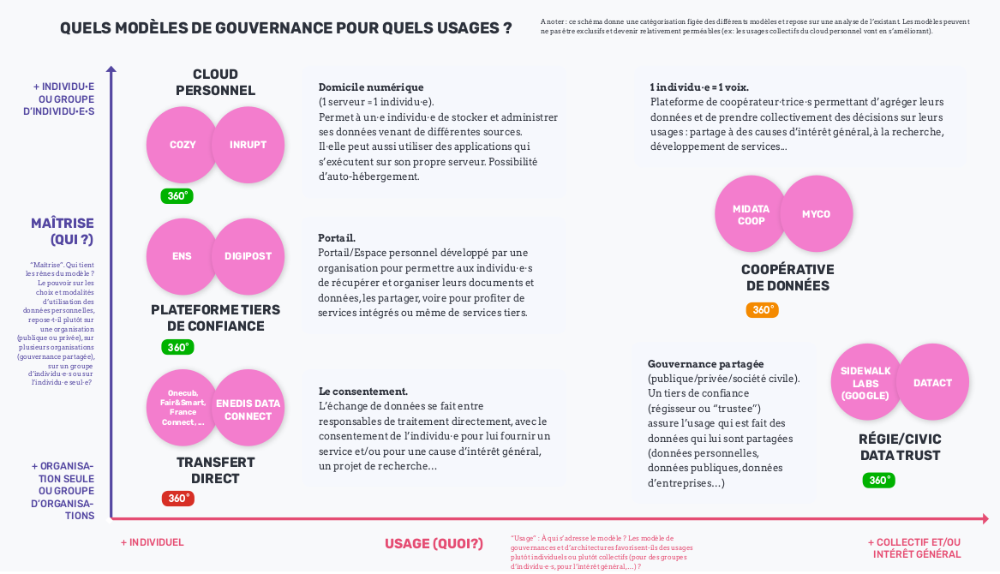
]

---

## Le self data territorial

.center[

]

Initié par MesInfos, le projet Self data territorial organise depuis 2018 la mise en place de dispotifis d'expérimentation sur trois territoires pilotes :

* **la métropole du Grand Lyon** ;
* **Nantes Métropole** ;
* **la Communauté d'Agglomération de La Rochelle**.

---

## La démarche de La Rochelle : mobilité, données, privacy

Le self data territorial de .lr_bg[la Communuauté d'Agglomération de La Rochelle] s'inscrit dans la continuité de deux grands projets territoriaux :

* La Rochelle Territoire Zéro Carbone ;
* Agremob.

.pull-left[
.center[
**Objectif**

*expérimenter avec un groupe de 500 bêtatesteurs et bêtatesteuses des outils de réappropriation des données et collecter des données scientifiques afin d'étudier les changements de comportement permis par l'information sur l'impact carbone des mobilités.*]
]

.pull-left[
.center[
**Partenaires**

* .red[**recruteurs**] : CdA La Rochelle, ville de La Rochelle, Université de La Rochelle, Excelia, Eigsi, J'adopte un projet ;
* .red[**scientifiques**] : Cnam, Excelia, Université de La Rochelle ;
* .red[**techniques**] : La Fabrique des mobilités, Cozy.
]
]

---

background-image: url("https://media.giphy.com/media/GvSU8xa3RNDVFjWOZz/giphy.gif")
background-size: contains
class: inverse

### Avec de nouveaux outils !

---

.center[
### Cozy - *le cloud personnel*
]

.pull-left-wide[
La société **Cozy cloud** met à disposition des participant·es un .red[**cloud personnel optimisé pour le self data territorial**].

]

.pull-right-narrow[
La société Cozy Cloud a développé à destination des bêtatesteurs et bêtatesteuses un **connecteur** dédié à TraceMob. Cette extension permet de récupérer les documents produits par l'app en format brut.

Le Cozy assure ici une fonction d'**archivage sécurisé et personnel** permettant de connecter les apps suivant le choix de son propriétaire.
]

---

### Vers CoachCO2 ...

.center[
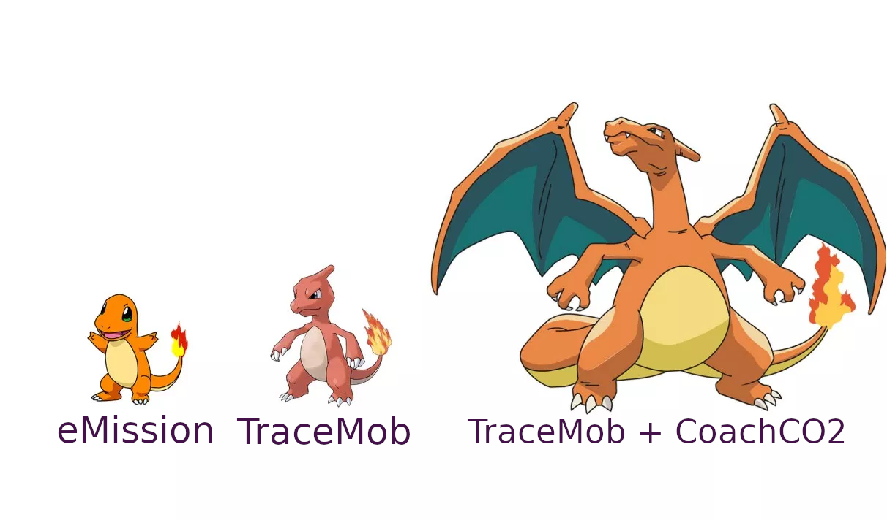
]

---

.center[
### CoachCO2 *l'outil d'aide au changement*
]

.pull-left-narrow[
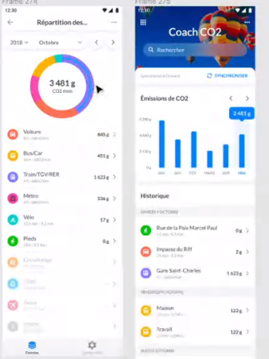
]

.pull-right-wide[.red[**CoachCO2**] offre plusieurs fonctionnalités sur la base des traces récoltées par les bêtatesteurs et bêtatesteuses ;

* exploration des traces via une interface de recherche avancée (avec filtres temporels, géographiques, par mode, etc.) ;
* annotation / correction ;
* historicisation des distances, émissions avec possibilité de regroupement ;
* comparaison à un groupe cible, à N -1 an, etc.

Ces fonctionnalités sont sélectionnées et évaluées avec l'aide d'un panel de participant·es volontaires.
]

---

### Des outils interconnectés pour un circuit de la donnée sécurisé

.center[
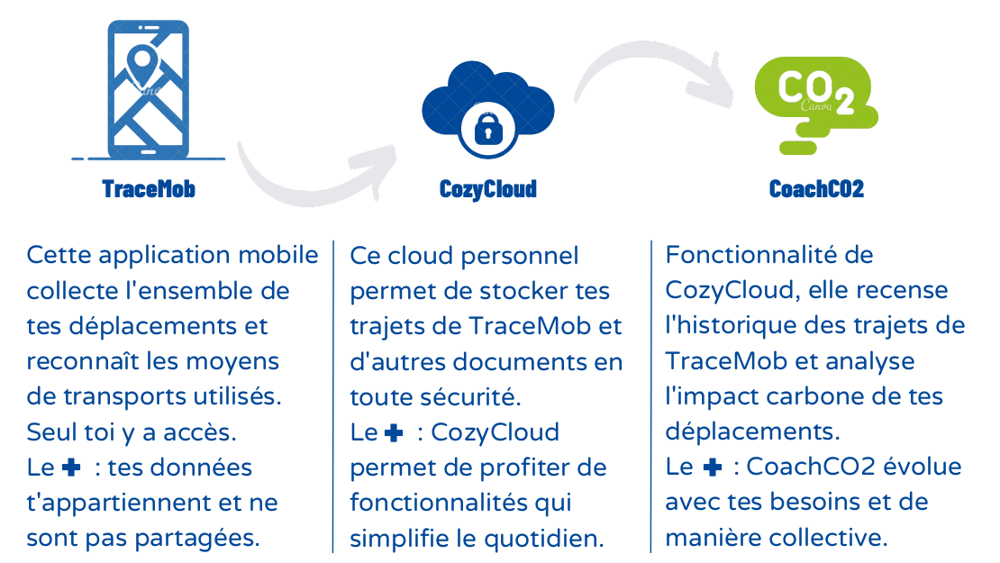
]

---

.center[
### Un projet scientifique !
]

.pull-left-wide[
Les bêtatesteurs et bêtatesteuses s'engagent également à participer à une .red[**collecte de données socio-métrologiques**] visant à mieux comprendre les mécanismes de changement de comportement.

Une équipe du Cnam assure la collecte de ces données auprès des participant·es via deux canaux :
* questionnaires scientifiques ;
* entretiens semi-directifs.

Ces données seront traitées et analysées dans le cadre de publications scientifiques. Elles font également l'objet de restitution auprès des participant·es et partenaires de l'expérimentation.
]

.pull-right-narrow[**Objectifs**

* étudier la capacité des outils numériques à changer des comportements ;

**Champs d'étude**

* sociologie ;
* socio-métrologie ;
* sciences de l'information.
]

---

background-image: url("./img/selfdatalr_qrcode.png")
background-size: contains
class: inverse

### Un projet auquel VOUS pouvez participer !

---

background-image: url("https://media.giphy.com/media/M960XBOtpI9nozI13V/giphy.gif")
background-size: cover
class: inverse

## En résumé, ce qu'on vous propose

.footnote[]

---

background-image: url("https://media.giphy.com/media/baPIkfAo0Iv5K/giphy.gif")
background-size: cover
class: inverse

## Et ce qu'on vous demande

.footnote[
.white-h[* télécharger et utiliser les apps ;
* répondre à 3 questionnaires sur l'année ;
* ... et puis c'est tout en fait !]
]

---

background-image: url("./img/selfdatalr_qrcode.png")
background-size: contains
class: inverse

### Merci pour votre attention !

#### *Contact : [Sylvain Lapoix](mailto:sylvain@datactivist.coop)*
