layout: true
  

`r paste0("
", params$event, " 

")` 

---

.center[

**Ce webinaire est organisé par le programme self data territorial de la Communauté d'Agglomération de La Rochelle**

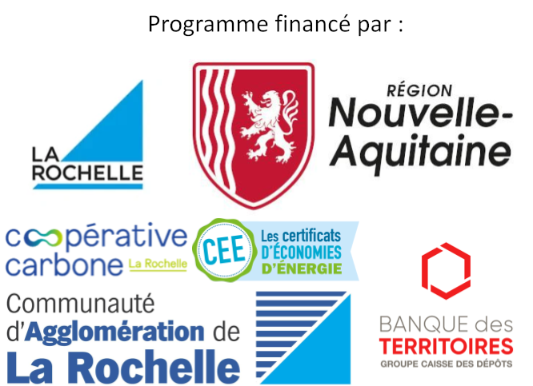

]

---

background-image: url("https://media.giphy.com/media/j1RdWetLBJQIdP8TnK/giphy.gif")
class: inverse

# 3. A quoi servent vos données de géoloc ?

---

background-image: url("https://media.giphy.com/media/xT0xewLy70uaFY3Vte/giphy.gif")
class: inverse

## 3.1 Les apps de mobilité

---

### L'usage direct des données de mobilité

La plupart des applications qui collectent vos données de mobilité le font pour accompagner les mobilités suivant des modalités classiques :

* **le tracking** : pour savoir où vous vous êtes rendu·es et quand afin de documenter vos déplacements ;
* **le path finding** : pour savoir quel chemin emprunter entre votre position et votre destination.

---

background-image: url("https://media.giphy.com/media/j1RdWetLBJQIdP8TnK/giphy.gif")
background-size: contains
class: inverse, center

### Qui parmi vous utilise Waze ?

---

background-image: url("https://media.giphy.com/media/EaMTsoYxfPpuw/giphy.gif")
background-size: contains
class: inverse, center

### Qui parmi vous utilise Strava ?

---

background-image: url("https://media.giphy.com/media/i44JJHlvLsbIjY7uJ4/giphy.gif")
background-size: contains
class: inverse, center

### Qui parmi vous utilise Géovélo ?

---

background-image: url("https://media.giphy.com/media/3oxRmGNqKwCzJ0AwPC/giphy.gif")
background-size: contains
class: inverse, center

### Qui parmi vous utilise VisoRando ?

---

background-image: url("https://media.giphy.com/media/1wANL9kM16LyszJjms/giphy.gif")
background-size: contains
class: inverse, center

### En fait, elles marchent presque pareil ...

---

#### Capter les données GPS 1/2

Dès qu'un mouvement est capté par .red[l'accéléromètre], l'app débute la collecte des données issues du .red[GPS] (elle peut se brancher sur d'autres capteurs pour être plus précise : WiFi, Bluetooth, 4G ou 5G).

.center[

]

---

#### Capter les données GPS 2/2

Quand .red[l'accéléromètre] note un arrêt prolongé du mouvement, l'app cesse la collecte de données du capteur .red[GPS].

.center[

]

---

background-image: url("https://media.giphy.com/media/bcrOR2stk6tKIxqPOZ/giphy.gif")
background-size: contains
class: inverse, center

### Mais alors, quelles sont les différences ?

---

### La façon dont les données sont analysées

Quels sont les *"priorités"* des apps ?

.pull-left[
* .red[Waze] cherche **l'efficacité** ;
* .red[Strava] cherche **la performance** ;
* .red[Géovélo] cherche **l'efficacité** et **la sécurité**.
]

--

.pull-right[
> Et quelles dimensions ne sont pas envisagées ?

]

--

Par exemple :

* le coût de l'essence ;
* la dangerosité du trajet ;
* la beauté des paysages ;
* la fatigue du sportif ou de la sportive ;
* etc.

---

### Prenons l'exemple de Waze

.pull-left[L'appli Waze fonctionne selon un principe de *crowdsourcing* :

1. de la géolocalisation des véhicules ;
2. des signalements des automobilistes ;
3. des informations sur les comptes individuels.

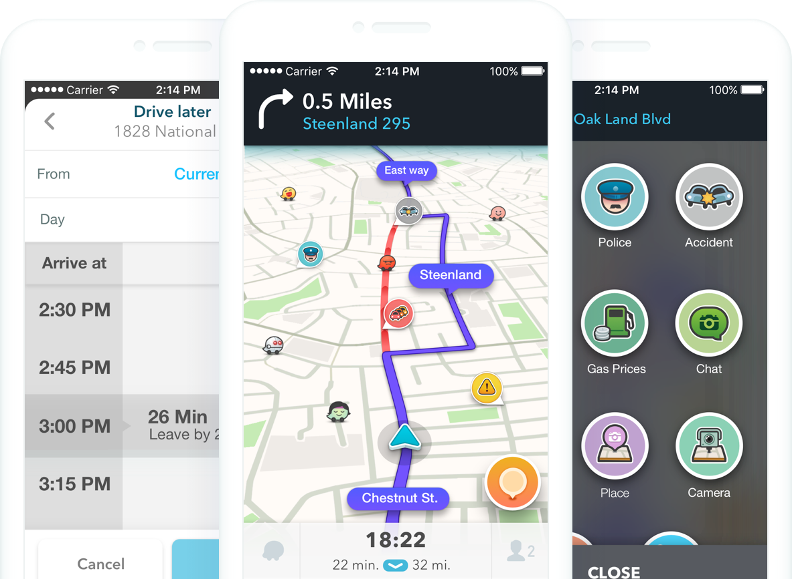

]

.pull-right[Les données personnelles sont donc collectées et traitées pour élaborer des itinéraires.

Waze vous propose **sa** version de l'itinéraire, selon ses critères (principalement durée du trajet et péages).

L'app se réserve le droit de réutiliser vos données selon ses propres termes (collecte, traitement, stockage et partage.]

---

background-image: url("https://media.giphy.com/media/kbUXGJHxS80O1GJwEx/giphy.gif")
class: inverse

## 3.2 Les services géolocalisés

---

### L'usage indirect des données de mobilité

De nombreuses applications ou services web récoltent des données de mobilité pour aider à la recherche de lieux ou objets dans l'espace.

Les données de localisation sont ainsi mobilisées à deux endroits :

* **côté question** : l'appareil qui fait la recherche utilise l'emplacement pour trier les réponses et offrir les plus pertinentes ;
* **côté réponse** : les données collectées historiquement auprès d'autres appareils servent à documenter les résultats.

--

Ce mécanisme s'avère techniquement très proche de celui des moteurs de recherche : **la recommandation se fait en croisant les données de la demande avec l'historique des données des demandes précédentes**.

---

### Exemple : Google

.pull-left-narrow[
Dans [sa rubrique sur la confidentialité](https://policies.google.com/technologies/location-data?hl=fr), Google détaille les raisons de sa collecte :

1. améliorer la qualité des résultats ;
2. documenter l'affluence dans les lieux ;
3. assurer des fonctionnalités (choix de la langue, sécurité, etc.)

]

.pull-right-wide[
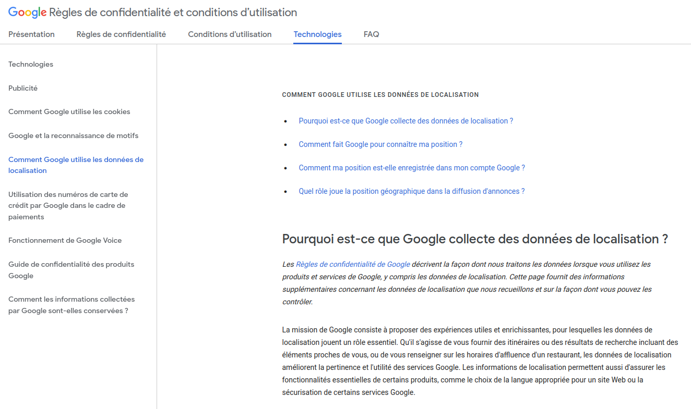
]

---

### En pratique ...

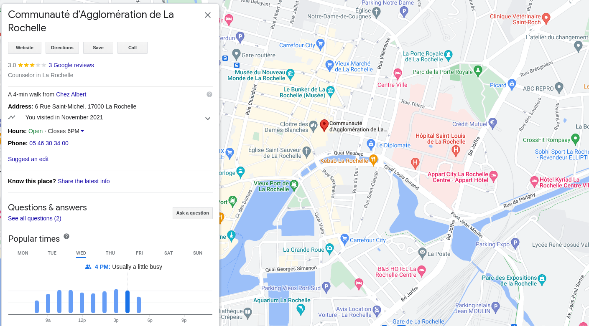

.footnote[Les données de fréquentation proposées pour les établissements sont tirées de l'historique de géolocalisation d'autres usagères et usagers de Google (en un mot : du crowdsourcing, comme tout à l'heure).]

---

background-image: url("../webinaire_mobilites_complet/img/cassili_travail.png")
background-size: cover
class: inverse, bottom

### .black-h[Travail invisible]

.black-h[
De la même manière que nos avis sur TripAdvisor, AirBNB et autres créent de la valeur pour ces services, le fait de fournir nos données de localisation à des services qui les valorisent créé de la valeur.

Ainsi, suivant la thèse du chercheur Antonio Casilli, nous *"travaillons"* pour Google et les autres applications en fournissant nos données de localisation. 

Source illustration : [Le Monde](https://www.lemonde.fr/pixels/article/2017/03/11/sur-internet-nous-travaillons-tous-et-la-penibilite-de-ce-travail-est-invisible_5093124_4408996.html).
]

---

background-image: url("https://media.giphy.com/media/1MZkQnzAKzLYQ/giphy.gif")
class: inverse

## 3.3 Toutes les autres apps ...

---

class: inverse, center

### Tracké par une lampe torche

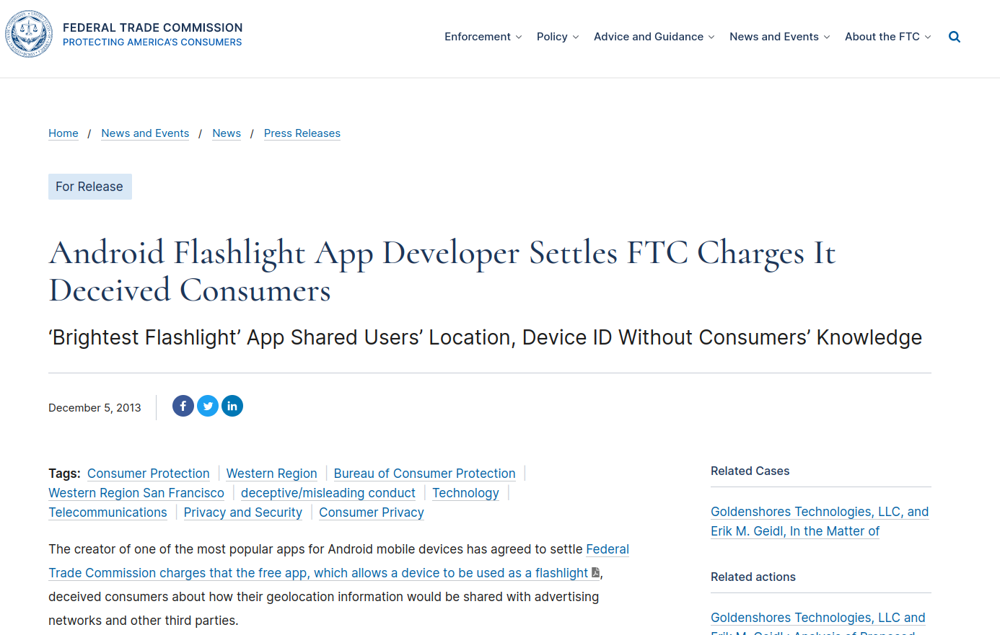

.footnote[Source : [FTC, 2013](https://www.ftc.gov/news-events/news/press-releases/2013/12/android-flashlight-app-developer-settles-ftc-charges-it-deceived-consumers).]

---

### Des applications pour enfants

L'Université de Berkeley a mené [une étude sur les donneés collectées par plus de 80000 apps destinées aux enfants](https://alumni.berkeley.edu/california-magazine/fall-2018-culture-shift/childs-play-are-apps-collecting-childrens-data). Les conclusions ne sont pas très rassurantes : 5% des apps étudiées collectent géolocalisations ou données de contact sans possibilité de vérifier le consentement des parents.

Relayant l'étude, [le site TheToyZone](https://thetoyzone.com/the-most-invasive-kids-apps) a étudié 107 apps pour enfant de tout type (illustration ci-dessous). Sur l'échantillon, seules 17 ne collectaient pas de données d'usage.

.center[
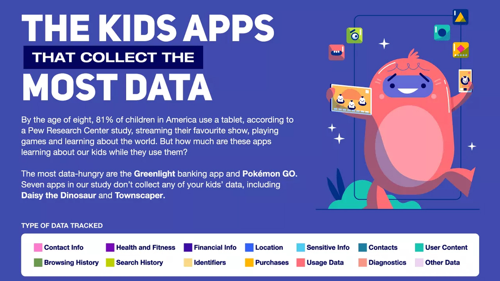
]

---

background-image: url("https://media.giphy.com/media/NRXkUDFD50xUIHsYwY/giphy.gif")
class: inverse

# 4. Sortie de route : le repartage

---

background-image: url("https://media.giphy.com/media/KPKkWMWA2067m/giphy.gif")
class: inverse

## 4.1 D'autres versions de vos apps existent ...

---

### Des "données situées"

.pull-left[

La chercheuse Jill Walker Rettberg a étudié l'application Strava pour introduire le concept de *données situées* (ou *[situated data](https://medium.com/nightingale/its-data-not-reality-on-situated-data-with-jill-walker-rettberg-d27c71b0b451)*). 

]

.pull-right[
En pratique, Strava collecte principalement les données GPS des usager·ères.

Elle identifie quatre façons dont l'entreprise Strava les distribue :
1. on voit ses propres données dans l'app ;
2. on voit les données globales en datavisualisations ;
3. les urbanistes peuvent acheter un accès à des dashboards avec Strava Metro ;
4. la donnée peut être transférée et traitée par une application de navigation tièrce pour calculer le meilleur chemin.
])

---

### Strava Metro

.center[
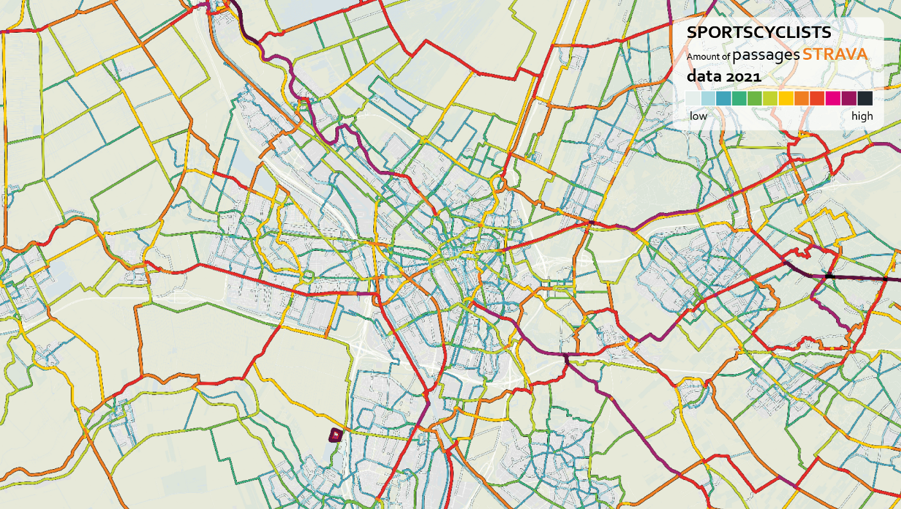
]

.footnote[Source : [Strava Metro](https://medium.com/strava-metro/evaluating-and-utilizing-strava-metro-cycling-data-in-the-netherlands-34f834b346c9)]

---

background-image: url("https://media.giphy.com/media/VcsirNyF0MYPB0KLLp/giphy.gif")
class: inverse

## 4.2 Le marché de la donnée

---

### A quoi servent les données de géoloc ?

L'intérêt des données de géolocalisation mobile est qu'elles permettent d'établir un lien entre digital et physique : **les traces numériques de nos déplacements renseignent sur nos comportements dans le monde physique**.

.pull-left[

]

.pull-right[
La plupart des personnes conservant leur téléphone sur elle à tout moment, leurs données de géoloc peuvent être assimilées à leur emplacement réel. C'est ce qu'on appelle un **proxy**.

A partir de là, les données de géoloc peuvent être utilisées pour documenter des comportements physiques :

* déplacement dans l'espace ;
* comportement d'achat ;
* mode de déplacement, etc.

]

---

.pull-left[
### La vente de données

Le marché du "courtage de données en localisation" a été estimé à 12Mrds$.

Le leader mondial du secteur, [Near](https://near.com/fr/), revendique des données sur 1.6 milliards de personnes dans 44 pays.

Source : [The Markup](https://themarkup.org/privacy/2021/09/30/theres-a-multibillion-dollar-market-for-your-phones-location-data) (ci-contre).
]

.pull-right[
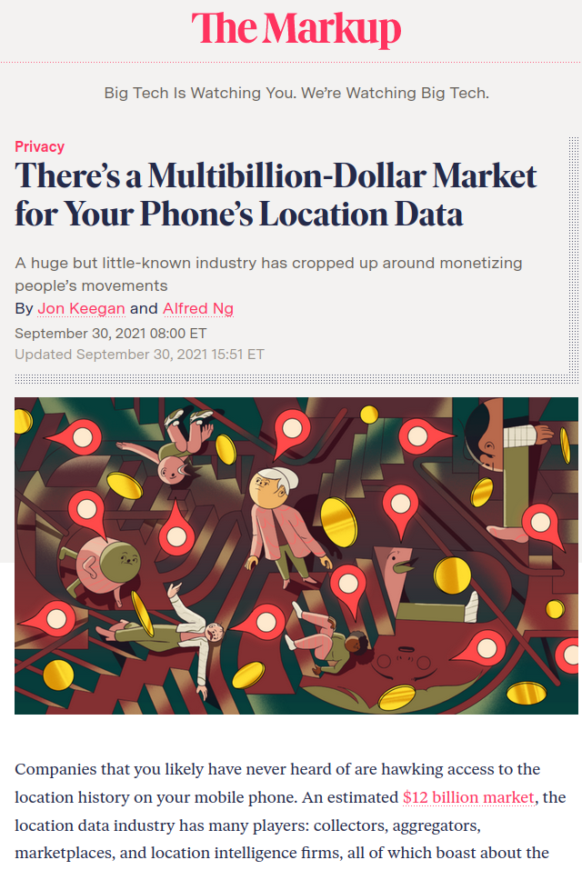
]

---

### L'identifiant publicitaire : clef de ciblage

L'outil principal du ciblage mobile est **l'identifiant publicitaire**. Il s'agit d'une chaîne de caractère unique (une série de signe comprenant lettres, chiffres, symboles et ponctuation) rattaché à votre téléphone et qui permet de connecter des points de localisation à un appareil. Une sorte de *"cookie"* mais rattaché à un objet physique.

La Cnil s'appuie notamment sur cette méthode pour étudier des données de géolocalisation obtenues auprès d'un data broker et évaluer les risques pour la vie privée des individus ([source](https://www.cnil.fr/fr/la-cnil-lance-une-etude-sur-les-donnees-de-geolocalisation-collectees-par-des-applications-mobiles)) :

.center[
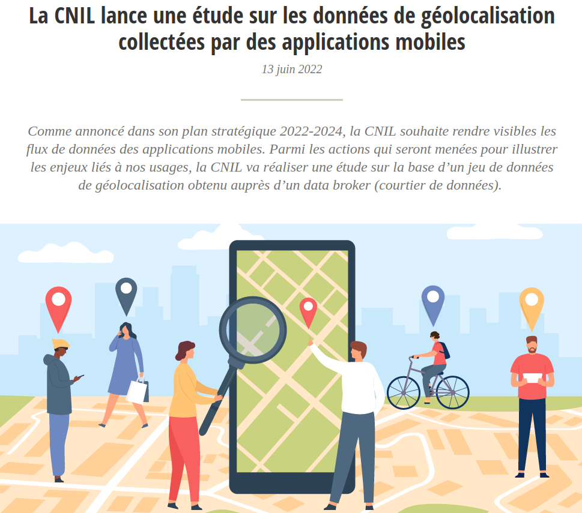
]

---

### Méthode utilisée en France par Teemo

.center[
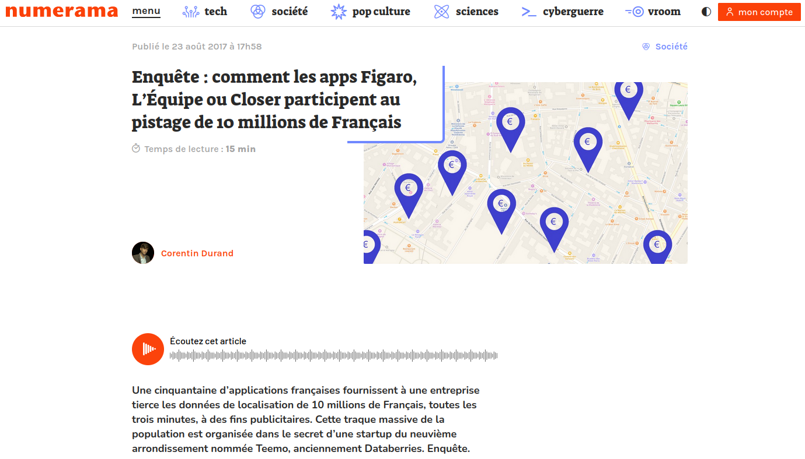
]

Source : [Numérama](https://www.numerama.com/politique/282934-enquete-comment-les-apps-figaro-lequipe-ou-closer-participent-au-pistage-de-10-millions-de-francais.html).

---

### Ah, au fait ...

--

.center[
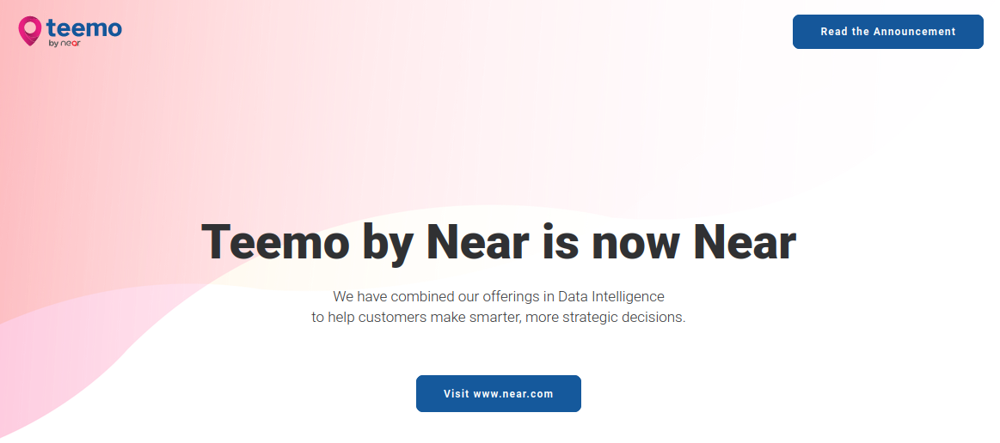
]

[Teemo](https://teemo.co/en/) a depuis été racheté par Near.

---

class: inverse, center

## Prochain épisode : comment protéger vos données ?

### Rendez-vous jeudi 25 août à 13h30

---

background-size: contains
class: inverse, center

### Envie de participer à un projet citoyen respectueux de vos données ?

**Rejoignez l'expérimentation self data territorial menée par la Communauté d'Agglomération de La Rochelle et Agremob !**

.footnote[*Pour plus d'info, envoyez un mail à [larochelle@selfdata.org](mailto:larochelle@selfdata.org)*]
